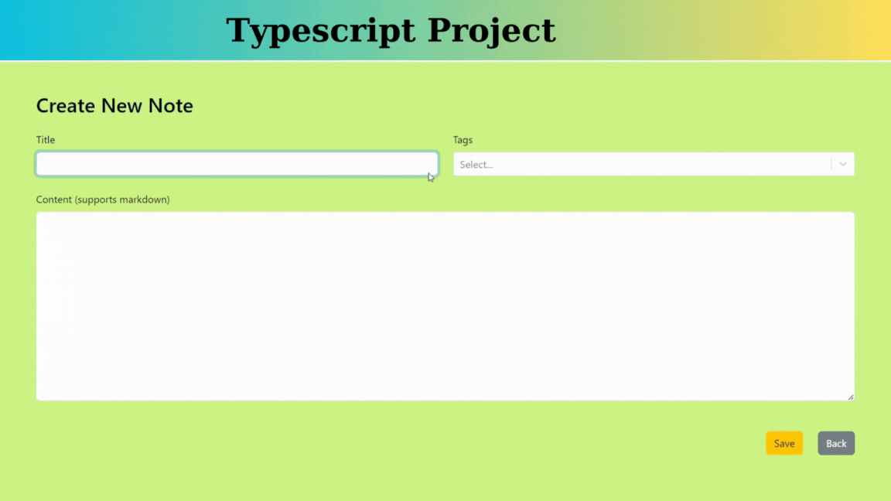

## Note Application

This project is a note-taking application where users can create notes, search for notes by tags or titles, and perform delete and edit operations on their notes. Note content is formatted with Markdown support.

### Technologies and Libraries Used

- **React**: For building the user interface.
- **TypeScript**: For writing more robust and reliable code.
- **Redux Thunk**: For managing asynchronous operations.
- **React Router DOM**: For page navigation and routing.
- **React Bootstrap**: For UI components.
- **Bootstrap**: As a CSS framework.
- **React Markdown**: For Markdown support.
- **React Select**: For tag selection.
- **UUID**: For generating unique IDs.

### Features

- **Note Creation**: Users can create new notes.
- **Note Search**: Notes can be searched by tags or titles.
- **Note Deletion**: Users can delete their notes.
- **Note Editing**: Users can edit their existing notes.
- **Markdown Support**: Note content can be written in Markdown format.

### GIF

